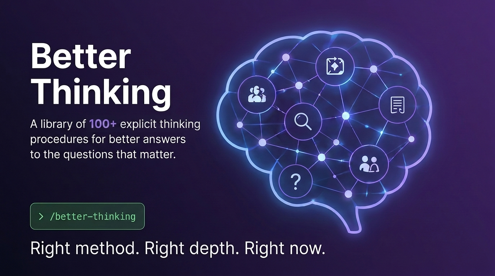
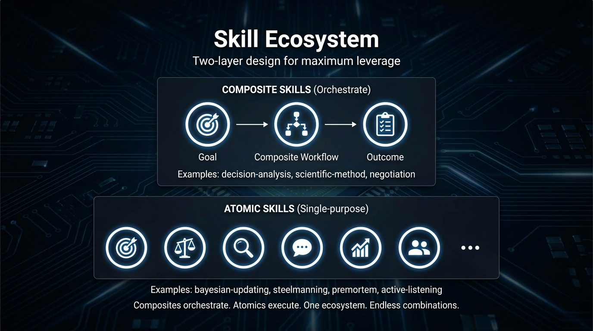
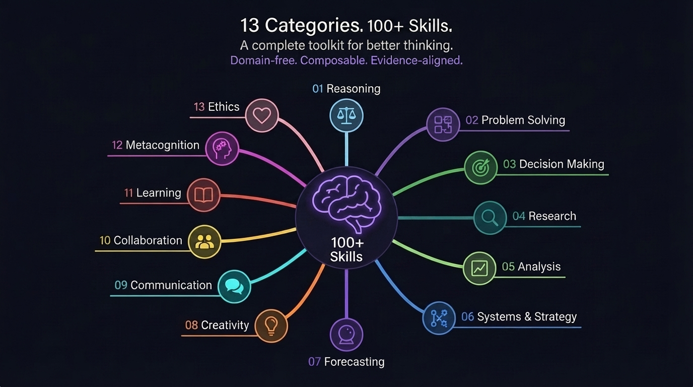
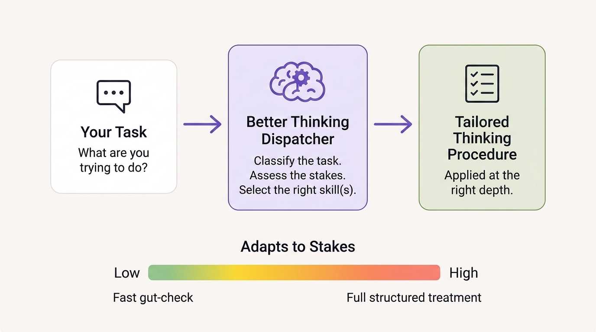
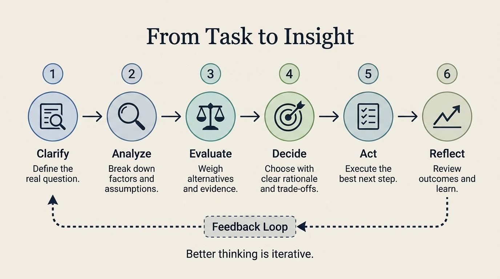

# Better Thinking



Models don't get smarter when you ask them to think harder - they get better when you give them a better *procedure* to think with.

Structured reasoning (naming assumptions, weighing alternatives, checking evidence) reliably produces better answers than "think step by step" ever could, but Claude usually defaults to the first reasonable-sounding approach instead of the rigorous one for the situation.

Better Thinking is a plugin that gives it a library of 135 explicit thinking procedures, e.g.:

1. How to run a proper decision analysis.
2. How to debug from symptoms to root cause.
3. How to evaluate competing hypotheses.

Better Thinking has a dispatcher that picks the right method for the task in front of it, instead of you having to know which technique to ask for.

Think of it less like a persona ("act like an analyst") and more like a checklist a skilled analyst would actually follow.





## How to activate it

Once installed (see below), just start any nontrivial task by typing:

```
/better-thinking
```

That's it. It looks at what you're asking, classifies the task (is this a decision? a diagnosis? a negotiation? research?) and how much is riding on it, then pulls in the right thinking skill(s) at the right depth automatically.



A quick, low-stakes question gets a fast gut-check; a costly, hard-to-reverse decision gets the full structured treatment.

You don't need to memorize any of the 135 skill names - `/better-thinking` reads the index and routes for you.



## Installation

This repo is a Claude Code plugin. Install it directly from GitHub:

```
/plugin marketplace add skyf0xx/better-thinking
/plugin install better-thinking@better-thinking
```

Or from a local clone:

```
/plugin marketplace add /path/to/better-thinking
/plugin install better-thinking@better-thinking
```

This registers `/better-thinking` (plus `/better-thinking-recipes` for named frameworks) as slash commands. Every other skill is not independently invocable — `/better-thinking` reads [skills/INDEX.json](skills/INDEX.json) to select and apply the right one instead of surfacing a crowded name list.

## What a Skill is (and is not)

A Skill encodes a *procedure*, never a *persona*.

**Bad:** "Act like a scientist."

**Good:**

1. Form hypotheses.
2. Identify assumptions.
3. Design experiments.
4. Evaluate evidence quality.
5. Attempt falsification.
6. Update confidence.
7. Report remaining uncertainty.

Excluded by design: programming languages, framework knowledge, APIs, professional personas, static reference material. If it isn't a transferable thinking process, it doesn't belong here.

## Atomic vs. Composite

The collection is two-layered:

- **Atomic skills** implement a single cognitive algorithm — one move, done well. Examples: `bayesian-updating`, `steelmanning`, `premortem`, `active-listening`. Atomic skills have no required dependencies (they may *suggest* related skills).
- **Composite skills** orchestrate atomic skills into a larger workflow. Examples: `scientific-method`, `decision-analysis`, `competing-hypotheses`, `negotiation`. Composite skills **declare their dependencies** in frontmatter, and their procedures read like pipelines: each step either does local work or *invokes* a named atomic skill.

This keeps the ecosystem modular: improving one atomic skill upgrades every composite that uses it, and new composites can be assembled without writing new cognition from scratch.

## Repository layout

```
README.md               ← you are here
SKILL_TEMPLATE.md       ← canonical template every skill follows
catalog/                ← full specification of every skill, by category
  01-reasoning.md
  02-problem-solving.md
  03-decision-making.md
  04-research.md
  05-analysis.md
  06-systems-strategy.md
  07-forecasting.md
  08-creativity.md
  09-communication.md
  10-collaboration.md
  11-learning.md
  12-metacognition.md
  13-ethics.md
skills/
  better-thinking/SKILL.md         ← general dispatcher entry point (slash command)
  better-thinking-recipes/SKILL.md ← named-framework discovery + execution entry point (slash command)
  library/<name>.md                ← every other skill: reference content the dispatcher reads and applies, not an independent slash command
  INDEX.json                       ← machine-readable index; better-thinking reads this to route instead of relying on memorized recall
recipes/                ← named-framework mappings (design thinking, ...) onto skill sequences
```

## Design principles

1. **Algorithm, not vibe.** Every skill has a numbered procedure a model can actually execute. If a step can't fail, it isn't a step.
2. **Domain-free.** A skill must work equally well on a medical question, a legal dispute, a product decision, and a debugging session. Domain examples illustrate; they never define.
3. **Composable.** Atomic skills are single-responsibility. Composites declare dependencies and orchestrate; they never re-implement an atomic procedure inline.
4. **Explicit activation.** Every skill states *when to fire* — trigger conditions a model can pattern-match against the task at hand, and anti-triggers for when it's overkill.
5. **Honest output contracts.** Every skill states what it consumes and what it produces, so skills can be chained like functions.
6. **Failure-aware.** Every skill lists its characteristic misuses, because a thinking tool applied wrong is worse than no tool.
7. **Token-budgeted.** Every skill carries a footprint estimate so orchestrators can reason about the cost of loading it.

## Recipes

Recipes map a named framework you already know — Design Thinking, Lean Startup — onto a sequence of skills from this collection, stage by stage. If you're looking for "what's the better-thinking equivalent of framework X," start at [recipes/README.md](recipes/README.md) rather than the skill index.

## Difficulty & footprint conventions

- **Difficulty (D1–D5):** how hard the skill is to execute *well*. D1 = mechanical checklist; D3 = requires judgment at each step; D5 = requires orchestrating many judgment calls under uncertainty.
- **Token footprint:** estimated size of the final SKILL.md body. Atomic skills target **300–700 tokens**; composites **800–1,500** (they lean on their dependencies for detail).